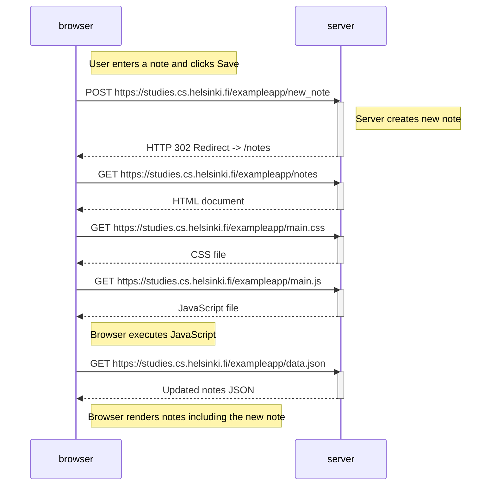

# Exercise 0.4: New Note Diagram

## What happens?

1. User writes a note and clicks **Save**.
2. Browser sends a **POST** request to `/new_note`.
3. Server saves the note.
4. Server responds with a **302 Redirect** to `/notes`.
5. Browser reloads the page.
6. Browser requests HTML, CSS, JavaScript, and note data again.
7. Notes are rendered including the new note.

## Mermaid Code

