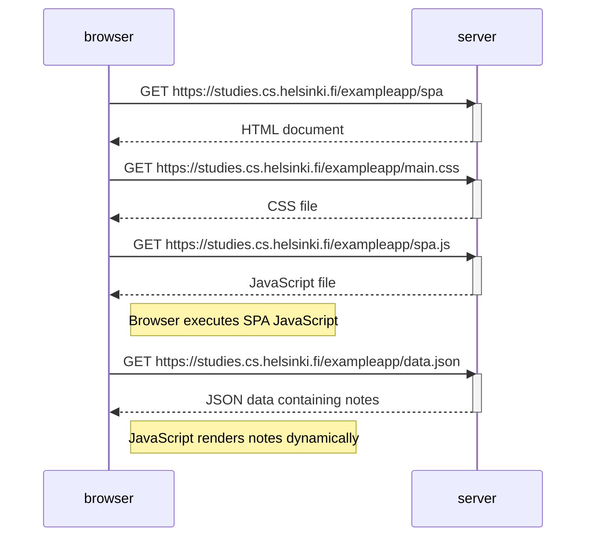

# Exercise 0.5: Single Page App Diagram

## What happens?

1. User opens `/spa`.
2. Browser requests the SPA HTML page.
3. Browser requests CSS.
4. Browser requests JavaScript.
5. JavaScript runs.
6. JavaScript fetches note data from `/data.json`.
7. Notes are rendered without any extra page reloads.

## Mermaid Code

