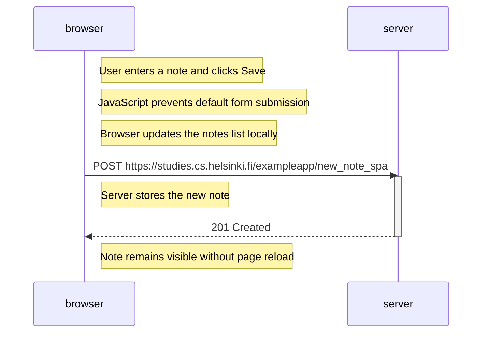

# Exercise 0.6: New Note in Single Page App Diagram

## What happens?

1. User enters a note.
2. User clicks **Save**.
3. JavaScript intercepts the form submission.
4. Browser updates the notes list immediately.
5. Browser sends JSON data to the server using POST.
6. Server saves the note.
7. Server returns a success response.
8. No page reload occurs.

## Mermaid Code

